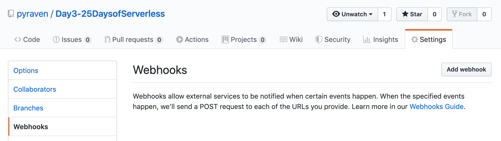
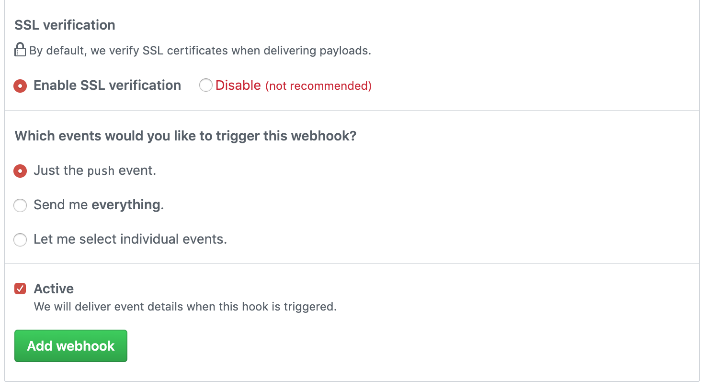
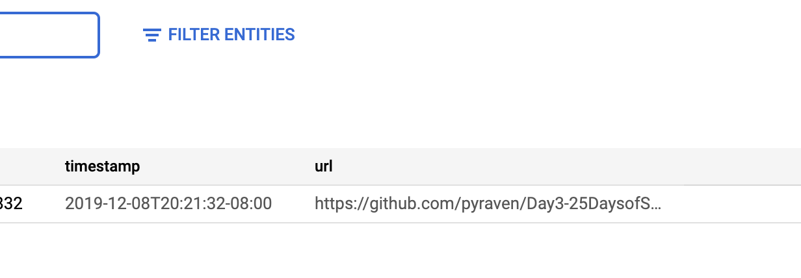

# Challenge:
For this challenge, create a web service that gets called everytime a commit or push is made to a Github repository. If the commit has a file ending with .png, your service should take the URL to the image from Github and store it in whatever database you like.

Solution to Day 3 of the #25DaysOfServerless.

When a commit or push happens to the repo, a github webhooka triggers a cloud function. It scrapes the request JSON for commits containing '.png'. It then grabs the timestamp and url of the github image (blob) and sends the info the GCP datastore.

The Cloud Function has to environment variables: id and kind of the datastore entity.

Webhooks in Github

Webhook enabled pointed to Cloud Function Endpoint (HTTP Trigger)

Proof in datastore after pushing a 'png' to this repo:

